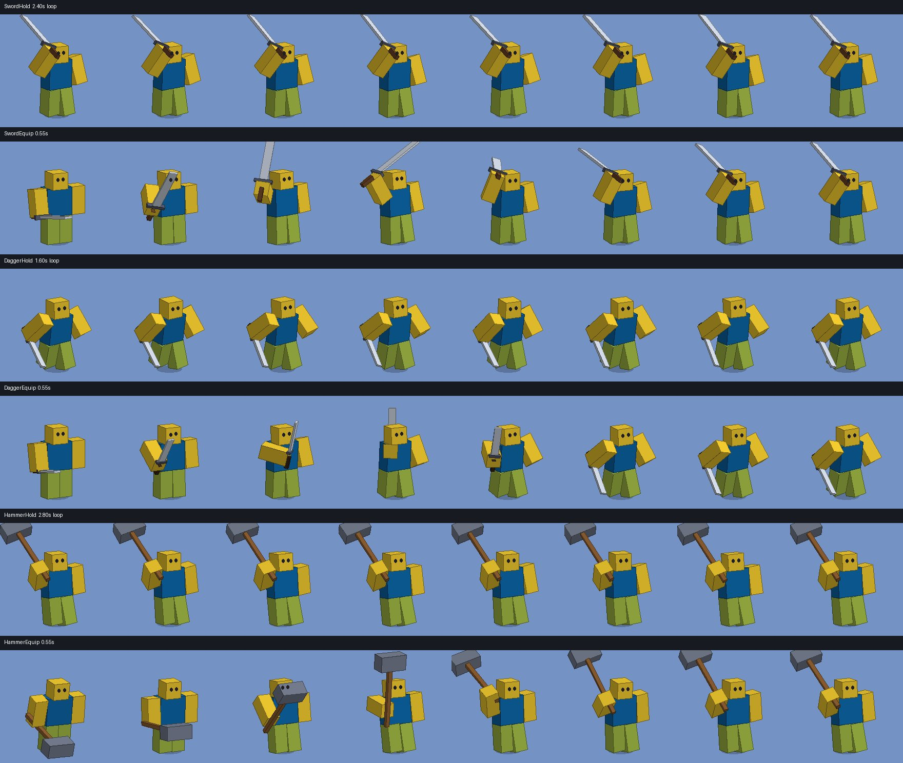

# FOLK VALLEY [RUN]: animations

`out/FolkValley_Animations.rbxm` holds the game's **Sequences** folder: the 64 original KeyframeSequences, improved, plus 6 new weapon animations. Every original keeps its name, length, looping and priority, so it drops straight in.



## What changed

**Everything moves smoothly now.**
- 28 of the 64 were authored with the **Constant** easing style on every pose, so each joint jumped from key to key instead of moving. Idle only had a key every 0.17 s, so it updated about 6 times a second.
- Those 28 include nearly everything you see all the time: Idle, Walk, Sprint, Jump, Fall, Land, the four hunter runs, all 9 swings, Slash, Stab, Smash, Tagged and Downed.
- Each animation is now a smooth curve through its original key poses, sampled at 30 fps with Linear keys. The poses and timing you made are kept; the in-between is filled in.
- The curves don't overshoot the original keys, loops end exactly where they start, and one-shots ease in and out.

**Polish by type:**
- **Walk, Sprint and the hunter runs:**
  - a step bob, low when the legs are apart
  - a steadier head that takes back part of the body's sway and nods with the steps
  - livelier arm swing on the unarmed runs, and a little more forward lean on Sprint and CatcherRun
- **Idle, NpcPete and NpcWanda** breathe (chest rise, shoulders open) and slowly look around.
- **Swings, Slash, Stab, Smash and Pounce** put more body into the strike: more torso twist and head follow-through.
- Dances and emotes keep their choreography and get the smoothing.

## New: weapon hold and equip animations

| Name | Loop | Priority | Use it |
|---|---|---|---|
| SwordHold | yes, 2.4 s | Movement | hunter standing still with a sword: blade up at the ready, breathing, off hand in guard |
| DaggerHold | yes, 1.6 s | Movement | hunter standing still with a dagger: low crouched stance, bouncing on the toes, guard arm up |
| HammerHold | yes, 2.8 s | Movement | hunter standing still with a hammer: resting on the shoulder, weight back |
| SwordEquip | no, 0.55 s | Action | when a sword is equipped: pulled up into a twirl overhead, settling into SwordHold |
| DaggerEquip | no, 0.55 s | Action | when a dagger is equipped: flicked up and spun in the hand, settling into DaggerHold |
| HammerEquip | no, 0.55 s | Action | when a hammer is equipped: heaved up and thumped onto the shoulder with a little bounce |

The sword and dagger holds use the same arm pose as CatcherRunSword and CatcherRunDagger, so switching between standing and running is seamless. Each equip ends exactly on the first frame of its hold. They assume the weapon sits in the standard tool grip, the right hand's RightGripAttachment, like the existing swing and run animations.

To hook them up:
- Play `<Weapon>Equip` once when the weapon is equipped.
- Play `<Weapon>Hold` while the hunter stands still, instead of Idle.
- Play `CatcherRun<Weapon>` while they run.

## Previews

- `previews/gifs/<Name>.gif`: every animation, played with a weapon in hand where it uses one.
- `previews/strips_*.jpg`: eight frames of each animation on one sheet.

These come from a small software renderer (`tools/render.py`). It poses the R6 rig with Roblox's standard Motor6D offsets, so what you see is what the KeyframeSequences do.

## Putting them in the game

Drag the `.rbxm` into Studio to get the `Sequences` folder. The KeyframeSequences still have to be published to Roblox as Animation assets, the same way you published the old ones:
- one at a time with the Animation Editor
- or all at once with your usual bulk-upload plugin

Publishing as new assets gives new AnimationIds. Overwriting the existing animation assets keeps the old IDs.

## Rebuild

```sh
rbxtool dump animition_for_game.rbxm in.json         # folk-valley-weapons/tools/rbxtool
python tools/improve.py in.json out.json --previews=previews
rbxtool build out.json out/FolkValley_Animations.rbxm
```

- `tools/anim.py` reads and writes KeyframeSequences and does the smooth resampling.
- `tools/improve.py` is the pipeline: smoothing, polish and the new animations.
- `tools/render.py` is the preview renderer.
