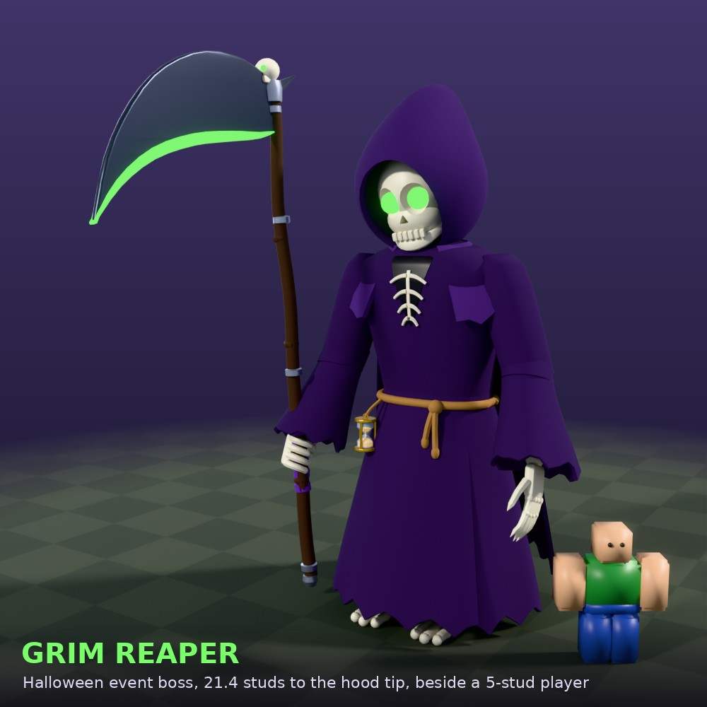
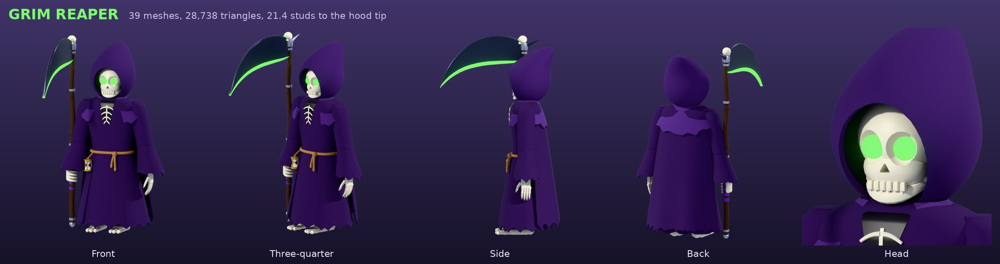
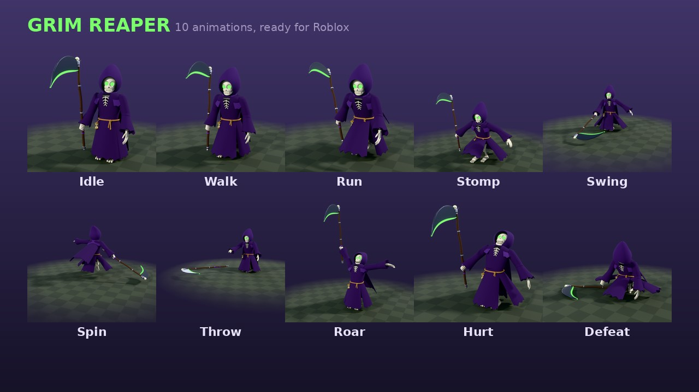
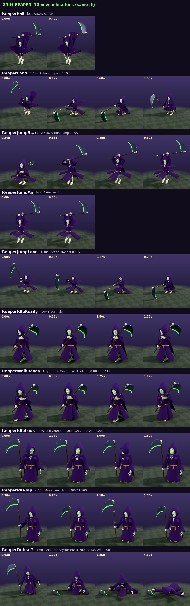

# FOLK VALLEY [RUN]: the Grim Reaper event boss

A big cartoon Grim Reaper for the Halloween event, made in Blender: a hooded purple robe, a grinning skull with glowing green eyes, a bony hourglass on a rope belt, a tattered cape and a huge scythe with a glowing edge. It stands 21.4 studs to the tip of its hood, about four times a player. It comes rigged for Roblox with 10 animations and a controller script that runs the fight.





The preview video `previews/reaper_animations.mp4` (41 s) shows a turntable, then every animation with its markers.

| File | What it is |
|---|---|
| `out/FolkValley_GrimReaper.fbx` | the 39 meshes (plus 4 small marker cubes) for Studio's Import 3D |
| `out/BuildGrimReaper.lua` | the Command Bar script that turns the imported meshes into the rigged `GrimReaper` model |
| `out/GrimReaper_Animations.rbxm` | a `GrimReaperAnimations` folder with the 10 KeyframeSequences |
| `out/GrimReaper_AnimationsMore.rbxm` | a `GrimReaperAnimationsMore` folder with 10 more for the same rig (see [More animations](#more-animations)) |
| `out/ReaperController.lua` | the controller script on its own, for reading (the build script already puts it in the model) |
| `previews/` | the stills above and the video |

## Put it in Studio

1. **File → Import 3D →** `out/FolkValley_GrimReaper.fbx` **→ Import.** The default settings are fine, but leave "Merge Meshes" off.
   - **The imported meshes are plain grey. That's normal:** step 2 colours them.
2. **View → Command Bar:** paste all of `out/BuildGrimReaper.lua` and press Enter. It builds `Workspace.GrimReaper`, standing on the ground where your camera is looking and facing the camera, then deletes the imported model. Ctrl+Z undoes it all.
3. **Drag `out/GrimReaper_Animations.rbxm` into ServerStorage.** Press Play and the boss uses these animations straight away.
   - This works in Studio play-tests only, though. Roblox only plays published animations in a live game, so see the next section.

### Publishing the animations for the live game

For each KeyframeSequence in `ServerStorage.GrimReaperAnimations`, do these steps:
1. Right-click it and choose **Save to Roblox** (or open it in the Animation Editor and Publish). Publish under the account or group that owns the game.
2. Copy the id into the matching attribute on the `GrimReaper` model, for example `AnimSwing = rbxassetid://1234567890`.

The attributes are `AnimIdle`, `AnimWalk`, `AnimRun`, `AnimStomp`, `AnimSwing`, `AnimSpin`, `AnimThrow`, `AnimRoar`, `AnimHurt` and `AnimDefeat`. If an attribute is blank, the controller uses that animation from the folder.

## The model

- **Facing:** −Z, the HumanoidRootPart's LookVector, like any Roblox character.
- **Root:** `HumanoidRootPart`, the PrimaryPart. It is 5 × 5 × 3, invisible and solid, with its centre 8.6 studs above the feet.
- **Humanoid:** R15 rig type, HipHeight 6.1, plus an Animator.
- **Parts:**
  - 39 MeshParts: CanCollide off, Massless, collision box only.
  - Each part belongs to a bone. The bone's main part is driven by a Motor6D, and its extra parts are welded to it.
- **Joints:** 22 Motor6Ds with the R15 names, `Root`, `Waist`, `Neck`, `LeftShoulder` … `RightAnkle`, plus:
  - `Jaw` (it opens to laugh and roar)
  - `ScytheGrip` (RightHand → Scythe, so the animations can move the scythe and even throw it)
  - `RobeFront`, `RobeBack`, `RobeLeft`, `RobeRight` and `Cape`, so the cloth swings
- **Attachments:**
  - `Overhead` on the root part, where the boss bar sits.
  - `EyeGlow` on the Head, with a green PointLight.
  - `Mouth` on the Jaw.
  - `LeftStomp` / `RightStomp` on the soles.
  - `BladeBase` / `BladeTip` on the Scythe, joined by the `ScytheTrail` Trail.
- **Built-in effects only, nothing to upload:**
  - glowing eyes;
  - a ghostly mist ParticleEmitter round the hem;
  - a green-to-purple trail on the blade during attacks.

## The animations

KeyframeSequences with keys every 1/30 s. Times below are at speed 1.

| Animation | Length | Priority | Markers |
|---|---|---|---|
| ReaperIdle | 3.40 s, loop | Idle | none |
| ReaperWalk | 1.50 s, loop | Movement | Footstep @ 0.000, 0.733 |
| ReaperRun | 0.90 s, loop | Movement | Footstep @ 0.000, 0.433 |
| ReaperStomp | 2.00 s | Action | **Impact @ 0.900** |
| ReaperSwing | 1.80 s | Action | **Hit @ 0.600** |
| ReaperSpin | 2.60 s | Action | **SpinStart @ 0.433**, SpinEnd @ 2.000 |
| ReaperThrow | 3.00 s | Action | **Release @ 0.633**, Catch @ 2.200 |
| ReaperRoar | 2.60 s | Action | Roar @ 0.800 |
| ReaperHurt | 0.80 s | Action2 | none |
| ReaperDefeat | 3.40 s | Action4 | ScytheDrop @ 1.600, Collapsed @ 2.400 |

- **Idle:** two slow breaths, a look round with a creepy head tilt, a beckoning claw and a dry chuckle.
- **Walk / Run:** at speed 1 the walk covers about 7.1 studs a second and the run about 18, so the controller sets the speed to actual speed ÷ that pace. The feet stay planted, and the robe panels swing out of the legs' way.
- **Stomp:** knee up high, a lean back, then a slam.
- **Swing:** a wind-up to the right, then one huge sweep across the front. The blade passes about 3 studs off the ground, right where players are.
- **Spin:** it rises a little off the ground and whirls round twice with the scythe held out low.
- **Throw:** the scythe whirls flat out in front at player height, loops round like a boomerang and flies back into its fist.
- **Roar:** it rears up with the scythe raised and its jaw chattering.
- **Hurt:** a quick flinch.
- **Defeat:** it staggers and drops to its knees. The scythe slips out of its fingers and clatters flat on the ground, and it slumps.

## More animations

`out/GrimReaper_AnimationsMore.rbxm` has 10 more KeyframeSequences for the same rig: same model, bone names and rest pose, so the boss already in the game plays them as they are. Times below are at speed 1.



| Animation | Length | Priority | Markers |
|---|---|---|---|
| ReaperFall | 0.80 s, loop | Action | none |
| ReaperLand | 1.60 s | Action | **Impact @ 0.167** |
| ReaperJumpStart | 0.50 s | Action | **Jump @ 0.400** |
| ReaperJumpAir | 0.60 s, loop | Action | none |
| ReaperJumpLand | 1.40 s | Action | **Impact @ 0.167** |
| ReaperIdleReady | 3.00 s, loop | Idle | none |
| ReaperWalkReady | 1.50 s, loop | Movement | Footstep @ 0.000, 0.733 |
| ReaperIdleLook | 2.80 s | Movement | Clack @ 1.267, 1.400, 2.200 |
| ReaperIdleTap | 2.60 s | Movement | **Tap @ 0.900, 1.500** |
| ReaperDefeat2 | 4.60 s | Action4 | ScytheDrop @ 1.700, Collapsed @ 3.200 |

- **Fall:**
  - Feet first, the robe and cape streaming up and fluttering, the scythe raised overhead in both hands.
  - At standing height its toes just reach the floor, so Land can take over when it lands.
- **Land:** it starts in Fall's pose. The scythe comes down and its blade is driven into the ground 17 studs out to the right front (Impact), in a deep crouch. It looks up, pulls the scythe free and rises to the idle hold.
- **The jump slam:**
  - JumpStart: a crouch while the scythe comes into both hands, then the leap. Jump is the frame the feet leave the ground.
  - JumpAir: airborne with the scythe overhead; loop it for as long as the jump lasts.
  - JumpLand: it starts in JumpAir's pose. Feet and blade smash down together straight ahead (Impact), then it recovers to idle.
  - The root part never moves in Fall, Land or the jump: the game moves the model.
- **IdleReady / WalkReady:** the scythe held in both hands across the body, the blade up over the left shoulder.
  - IdleReady has a wide stance, a slow sway and the head tracking from side to side.
  - WalkReady is the walk with the same hold, made for about 7 studs a second like ReaperWalk.
- **IdleLook / IdleTap:** fidgets to play over ReaperIdle.
  - They start and end at the idle pose.
  - At Movement priority they cover the idle, and attacks, Hurt and the defeats play over them. Stop them before it walks.
- **Defeat2:** it staggers back, stumbles, drops to its knees and lets the scythe fall (ScytheDrop). Then it keels over face down (Collapsed) and stays there.
- **The robe in the deep poses:** in the landings and when lying down, the robe settles a little into the floor instead of sticking out stiffly.

## The controller (`ReaperController` inside the model)

It plays the animations and runs a simple fight AI:
- it notices the nearest player and roars;
- it stalks (WalkSpeed) or chases (ChaseSpeed);
- it picks an attack that fits the distance:
  - close up: Stomp, Spin or Swing;
  - mid range: Swing or Spin;
  - 24 to 33 studs: Throw.

Hits land on the markers, at the moment the scythe connects. The distances are measured from the root part; "standing" means not more than about 7 studs up, so jumping at the right moment dodges.

| Attack | When | Where it hits |
|---|---|---|
| Stomp | Impact | within 18 studs of the foot's landing spot (1.5 right, 3.2 ahead of the root part), standing players; plus a green shockwave ring and dust |
| Swing | Hit | standing players up to 24 studs away, within 80° of where it faces |
| Spin | SpinStart to SpinEnd | standing players within 22 studs on every side, every 0.1 s (at most once per 0.6 s each) |
| Throw | Release to Catch | wherever the scythe whirls (its path is baked into the script), 8 studs round it; it turns first so its throw crosses the player |
| Roar | Roar | pushes everyone within 40 studs back, no damage |

### Settings and events

These are the attributes on the `GrimReaper` model:

| Attribute | Default | What it does |
|---|---|---|
| `AI` | true | chase and attack on its own (false: it only animates; attacks still work through `ReaperAttack`) |
| `AggroRange` | 140 | how far away it notices players |
| `WalkSpeed` / `ChaseSpeed` | 8 / 20 | stalking and running speed (studs a second) |
| `AttackCooldown` | 2.5 | seconds between attacks (× 0.65 once enraged) |
| `MaxHealth` | 1000 | its health |
| `Damage` | 0 | health one hit takes from a player; 0 = knockback only |
| `Knockback` | 70 | how hard hits throw players |
| `HealthBar` | true | a "GRIM REAPER" bar over its head |
| `RemoveOnDefeat` | true | fades away and removes itself after the defeat |
| `AnimIdle` … `AnimDefeat` | blank | published animation ids |

These BindableEvents are in the model for the game's own scripts:
- `ReaperAttack:Fire("Swing")` makes it attack now. The names are Stomp, Swing, Spin, Throw and Roar.
- `ReaperHit.Event` fires with `(player, attackName, damage)` for every hit.
- `ReaperDefeated.Event` fires once when its health runs out.

**Health:**
- The Humanoid's Dead state is turned off: when the health reaches 0 it plays its own defeat, so `Humanoid.Died` never fires. Use `ReaperDefeated` instead.
- At half health it becomes enraged: it roars, attacks more often and moves 15% faster.
- When damaged while it isn't attacking, it plays the hurt flinch.

**Sounds:** put Sound objects in a folder named `Sounds` inside the model. The names it plays are Footstep, Stomp, Swing, Spin, Throw, Catch, Roar, Hurt and Defeat.

## How it was checked

Everything was run outside Studio:
- `tools/mock_roblox.lua` is a stand-in for the engine. It rejects unknown classes, properties and enum items, and has a simulated clock and animation tracks that fire their markers.
- `tools/mock_boss.py` runs three checks in it:
  1. It builds the model from a fake import, with the importer scaling the file (×0.01, ×2.5) and turning it 90°. It checks every part, colour, weld, Motor6D, attachment and effect, and that the boss stands on the ground.
  2. It poses the built Motor6Ds with frames of every animation, and every bone lands where the animation tools put it.
  3. It runs a fight against a player. The boss roars, closes in from 100 studs and attacks. Each attack hits where it should and misses a player behind it, out of reach or jumping over the stomp. It also flinches, enrages at half health, plays its defeat, fires `ReaperDefeated` and removes itself.
- `tools/check_anims.py` checks the animations: where the blade is at each marker, that nothing dips under the ground, and that the scythe never passes through the body.

None of it has been run in real Studio yet, so the first play-test is worth watching.

## Making it again

All the source is here; with Blender's `bpy` module and numpy:

```
python blender/build_boss.py <dir> --fbx=out/FolkValley_GrimReaper.fbx     # model, rig data (<dir>/rig.json), FBX, preview renders
python tools/reaper_anims.py <dir>/rig.json anims.json                     # the 10 animations (rbxtool JSON)
python tools/reaper_anims_more.py <dir>/rig.json more.json                 # the 10 more (then rbxtool build as below)
rbxtool build anims.json out/GrimReaper_Animations.rbxm                    # folk-valley-weapons/tools/rbxtool
python tools/gen_boss.py <dir>/rig.json tools/ReaperController.lua out/BuildGrimReaper.lua --controller-out=out/ReaperController.lua
python tools/check_anims.py <dir>/rig.json anims.json
python tools/mock_boss.py out/BuildGrimReaper.lua <dir>/rig.json anims.json [--scale=0.01] [--turn]
python blender/render_anims.py <dir>/rig.json anims.json <renders> --frames   # then tools/reaper_video.py for the video
```

- `blender/reaper.py` is the model.
- `tools/banim.py` is the animation toolkit: leg IK, the scythe solver, cloth lag and the robe's floor collision.
- `tools/reaper_anims.py` holds the animations themselves, and `tools/reaper_anims_more.py` the 10 more, with the two-handed holds done by arm IK.
