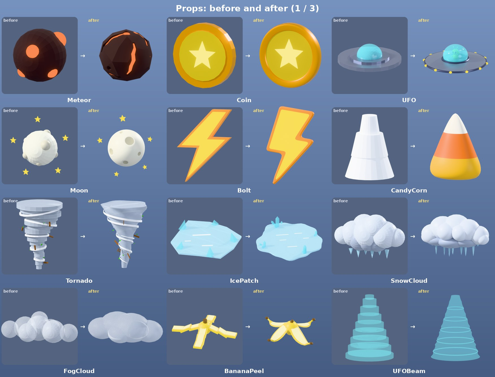
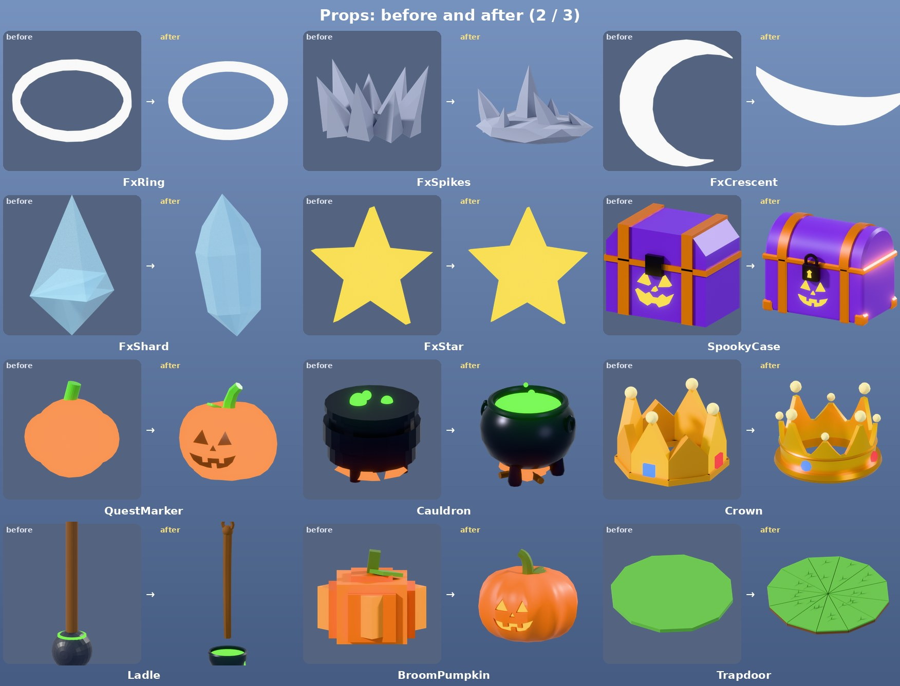
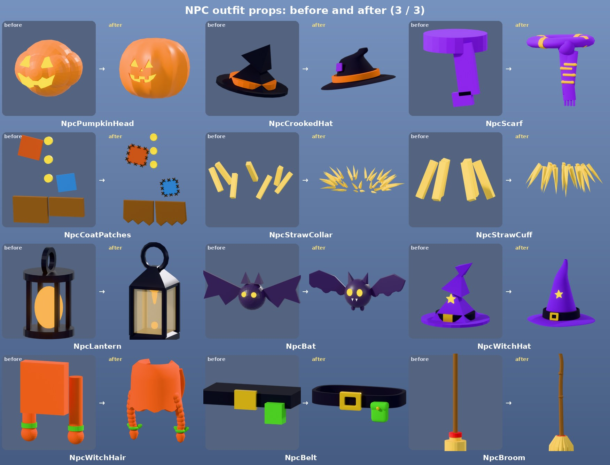
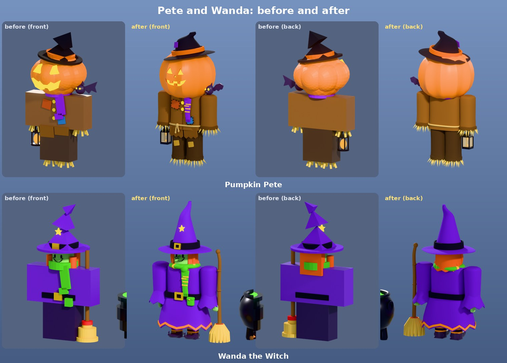

# FOLK VALLEY [RUN]: props and NPCs

All 36 props from `props.rbxm`, remade in Blender, and the two NPCs, Pumpkin Pete and Wanda the Witch, given proper clothes. Every prop keeps its name, Handle, attributes, part names, flags and welds, so the game uses them exactly as before.






| File | What it is |
|---|---|
| `out/FolkValley_Props.fbx` | every new mesh (152) for Studio's Import 3D |
| `out/BuildPropsAndNPCs.lua` | the Command Bar script that turns the imported meshes into the Props folder and the two NPCs |
| `previews/ba_props_*.jpg` | each old prop next to its remake, from the same angle |
| `previews/npcs_before_after.jpg` | Pete and Wanda, front and back, before and after |
| `previews/props_all.jpg`, `previews/npc_pieces.jpg`, `previews/wanda_cauldron.jpg`, `previews/tiles/` | the new props and NPC clothes one by one |

## Put them in Studio

New meshes have to be uploaded to Roblox by your account, and Studio does that while it imports them. A `.rbxm` file can't carry new mesh files, so getting them in takes one import and one script (the same as the weapons):

1. **File → Import 3D →** `out/FolkValley_Props.fbx` **→ Import.** The default settings are fine. Leave "Merge Meshes" off.
   - **The imported meshes are plain grey. That's normal:** colours, materials, welds and everything else come from step 2.
2. **View → Command Bar:** paste all of `out/BuildPropsAndNPCs.lua` and press Enter. It builds:
   - `ServerStorage.Props` with all 36 props.
   - `Workspace.NPCs` with Pete and Wanda, standing where they stood.
   - If either folder already exists, the new one gets "(new)" on the end. The imported model is deleted afterwards, and Ctrl+Z undoes everything.
3. Move the new `Props` folder to wherever the game keeps the old one, then delete the old `Props` and `NPCs` folders.

## What stays the same

- **Every prop:**
  - Model name and Handle: same size, position, flags and PrimaryPart.
  - The `Top` / `Bottom` attributes, re-measured on the new shapes. Most are within a few tenths of a stud of the old values.
  - A WeldConstraint from the Handle to each part, and each prop's Anchored / CanCollide / CanTouch / CanQuery / Massless / CastShadow settings.
- **Every old part name is still there**, so code that looks parts up still finds them: `Meteor.Glow`, `UFOBeam.Beam`, `Cauldron.Brew` and so on.
- **The effect props** (FxRing, FxSpikes, FxCrescent, FxShard, FxStar) are still one part each, still white or one colour, so code that tints or fades them still works.
- **Trapdoor:** the 12 `Flap` models with their `Hinge` PrimaryParts, the black `Void` and the invisible `SwirlA` / `SwirlB` / `Rim` parts are untouched. The new turf sits exactly where the old wedges were, so the flaps open the same way.
- **CandyCorn** keeps its Model scale of 1.4.
- **Crown, Ladle, BroomPumpkin** keep their anchoring and their spots.

Some props gained parts with new names (more colours):
- UFO: Trim, Emitter, Alien, AlienEyes
- Cauldron: Logs
- QuestMarker: Face
- NpcCrookedHat: Patch
- NpcScarf: Stripes
- NpcCoatPatches: Stitches
- NpcLantern: Glass
- NpcBat: Fangs
- BroomPumpkin: Stem
- Trapdoor: Soil and Grass, in every flap

## Pete and Wanda

**Unchanged:** the HumanoidRootPart, R6 limbs and Motor6Ds, the Humanoid and Animator, the attachments, the Talk prompts ("Pumpkin Pete", "Wanda the Witch"), the `Npc` attribute, the PrimaryPart (the Head, as before) and their positions. The NpcPete / NpcWanda animations play exactly as before.

**New `Body` folder:** clothes welded over each limb, with the R6 blocks hidden underneath (Transparency 1):
- **Pete:** a roomy farm coat with dark lapels, a centre seam and a rope belt; baggy sleeves with turned-back cuffs; patched trousers with rolled cuffs. Straw still pokes out of the cuffs.
- **Wanda:**
  - a purple dress with a fitted bodice and a flared skirt with an orange zigzag hem
  - bell sleeves with zigzag cuffs and green hands, the left one closed round the broom
  - black-and-orange striped stockings and pointy curled shoes with gold buckles
  - a long witch nose with a wart; her smile and eyes are still the face decal

**The `Outfit` folder** has the same items at the same spots with the same welds, now the new props. Wanda's scarf stays green, and her cauldron stays anchored and solid. Her broom now stands at her side with her hand round it; the old one went straight through her arm.

## The props

| Prop | Parts | Triangles | Look |
|---|---|---|---|
| Meteor | Rock, Glow | 1,898 | A chunky charred space rock split by glowing magma cracks, with the hot core showing through the cracks and a few deep glowing pits. |
| Coin | Rim, Face, Star | 1,232 | A fat gold coin: a rounded rim, a sunken face and a puffy glowing star on both sides. |
| UFO | Hull, Trim, Dome, Lights, Emitter, Alien, AlienEyes | 5,904 | Classic flying saucer: a lens-shaped hull with a trim band, a ring of round lights, a glowing beam emitter underneath and a glass dome with a little green pilot waving inside. |
| Moon | Moon, Craters, Stars | 6,664 | A big pale moon with smooth dished craters (soft raised rims, darker floors) and a ring of puffy glowing stars. |
| Bolt | Bolt, Edge | 888 | A fat cartoon lightning bolt with rounded corners and an orange outline. |
| CandyCorn | Base, Mid, Tip | 1,728 | A big glossy candy corn kernel: rounded, a little flat front to back, yellow base, orange middle and a white tip. |
| Tornado | Funnel, Bands, Debris, Leaves | 4,638 | A twisting cartoon twister: a lobed funnel that corkscrews up and flares out at the top, white wind ribbons spiralling round it, and planks and leaves caught up in it. |
| IcePatch | Ice, Shine, Crystals | 1,616 | A slippery puddle of ice: a rounded wobbly sheet with a soft edge, white glints, and clusters of ice crystals poking up round the rim. |
| SnowCloud | Cloud, Belly, Icicles | 5,210 | A fat cartoon snow cloud: big round puffs on top, a darker heavy belly and a row of icicles hanging underneath. |
| FogCloud | Puffs | 2,278 | A low rolling bank of fog: a few big soft puffs, flat underneath, see-through. |
| BananaPeel | Peel, Inside, Stem | 1,830 | A cartoon banana peel flopped on the ground: four floppy strips with curled tips, creamy insides, a little hump in the middle and the stem on top. |
| UFOBeam | Beam | 3,672 | The tractor beam: a smooth see-through cone of light with soft rings rippling down it. |
| FxRing | Ring | 768 | Shockwave ring: a flat, smooth rounded band. |
| FxSpikes | Spikes | 220 | A burst of chunky rock spikes punching out of a little pile of rubble. |
| FxCrescent | Arc | 220 | A slash swoosh: a smooth crescent that's thick in the middle and tapers to needle points, lying flat. |
| FxShard | Shard | 36 | An ice shard: a long faceted crystal, pointed at both ends. |
| FxStar | Star | 40 | A puffy little cartoon star. |
| SpookyCase | Box, Bands, Face, Lock | 1,176 | A Halloween treasure chest: purple with a round lid, orange iron bands and corner caps, a glowing jack-o'-lantern face and a big padlock. |
| QuestMarker | Pumpkin, Stem, Face | 1,460 | A glowing pumpkin to float over a quest giver: deep ribs so it reads even when it glows, a dark carved face, and a curly stem with a leaf. |
| Cauldron | Pot, Brew, Fire, Logs | 3,474 | A witch's cauldron: a round iron pot with a thick lip, ring handles and stubby feet, bubbling green brew, and a crackling fire on a little log pile underneath. |
| Crown | Band, Rim, Pearl, Jewel, Point | 3,680 | A chunky gold crown: a flared band with eight points, alternately tall and short, a pearl on every tip, a darker gold rim and four glowing jewels. |
| Ladle | Shaft, Cup, Brew | 1,240 | A witch's wooden ladle: a turned handle with a hanging loop, an iron bowl full of glowing brew, and a drip. |
| NpcPumpkinHead | Pumpkin, Face | 2,492 | Pete's head: a big ribbed jack-o'-lantern with a friendly carved grin glowing from inside. |
| NpcCrookedHat | Hat, Band, Patch | 1,346 | Pete's crooked old hat, sized for his pumpkin head: a floppy wavy brim, a tall cone that buckles and flops over, a purple patch and an orange band. |
| NpcScarf | Scarf, Stripes | 1,608 | A chunky knitted scarf wrapped round the neck, knotted at the front with two striped tails ending in a fringe. |
| NpcCoatPatches | PatchRed, PatchBlue, Buttons, Tails, Stitches | 1,496 | Pete's coat details: two stitched-on patches, three big buttons and the ragged coat tails hanging below the waist. |
| NpcStrawCollar | Straw | 616 | Tufts of straw poking out all round the collar. |
| NpcStrawCuff | Straw | 378 | Straw sticking out of a sleeve or trouser leg. |
| NpcLantern | Frame, Flame, Glass | 500 | An old iron lantern swinging from Pete's hand: a carry loop, a peaked cap, four corner posts round warm glass and a flickering flame. |
| NpcBat | Bat, Eyes, Fangs | 1,052 | Pete's pet bat: a round fuzzy body, big pointy ears, scalloped wings, glowing eyes and two tiny fangs. |
| NpcWitchHat | Hat, Band, Buckle, Star | 1,578 | Wanda's witch hat: a wide wavy brim, a tall cone with a bent tip, a black band with a gold buckle and a little glowing star. |
| NpcWitchHair | Hair, Ties | 2,864 | Wanda's bright orange hair: a thick wavy curtain round the back and sides of her head (open at the face), and two braids over her shoulders tied off with green ribbons. |
| NpcBelt | Belt, Buckle, Pouch | 1,048 | Wanda's belt: a black band round her dress, a big square gold buckle and a little green pouch with a button flap. |
| NpcBroom | Stick, Bristles, Binding | 1,360 | Wanda's broom: a knobbly crooked stick held at her side, a fat flared bundle of bristles and a red binding. |
| BroomPumpkin | Pumpkin, Glow, Stem | 2,510 | A jack-o'-lantern: round ribbed pumpkin, a glowing grin, a curly stem and a leaf (replaces the old block-built one, same size and spot). |
| Trapdoor | Turf, Soil, Grass | 1,056 | A hidden trapdoor: twelve wedge flaps of turf that drop open round the rim. Grassy tops with a few tufts, soil underneath (seen when it opens). The flaps, hinges and the black void keep their old positions. |

| NPC piece | Parts | Triangles | Look |
|---|---|---|---|
| PeteCoat | Coat, Lapels, Rope | 2,126 | Pete's old farm coat: a roomy patched coat flaring a little at the hem, dark lapels, a centre seam and a rope belt knotted at the front. |
| PeteSleeve | Sleeve, Cuff | 612 | A baggy coat sleeve with a dark turned-back cuff; straw pokes out of it. |
| PeteTrousers | Trousers, Patch | 848 | A baggy patched trouser leg with a rolled cuff. |
| WandaDress | Dress, Trim | 1,724 | Wanda's witch dress: a fitted purple bodice and a wide flared skirt with a zigzag hem trimmed in orange. |
| WandaSleeveR | Sleeve, Hand | 1,020 | Wanda's right sleeve: a fitted purple sleeve ending in a flared zigzag bell cuff, and her green hand. |
| WandaSleeveL | Sleeve, Hand | 1,020 | Wanda's left sleeve, her hand closed round the broom handle. |
| WandaLeg | Stocking, Stripes, Shoe, Buckle | 2,194 | A stripy stocking (black with orange bands) and a pointy witch shoe with a curled toe and a gold buckle. |
| WandaNose | Nose, Wart | 174 | A long pointy witch nose (with a wart) for Wanda's face. |

36 props in 133 meshes and 69,776 triangles (a median of about 1,500 per prop). The big sky and weather props are the heaviest: Moon 6,664, UFO 5,904, UFOBeam 3,672 and SnowCloud 5,210. The NPC clothes add 19 meshes and 9,718 triangles. Every prop was checked for z-fighting between parts (none) and for keeping all its old part names (all kept).

## Rebuild

```sh
rbxtool dump props.rbxm orig_props.json    # folk-valley-weapons/tools/rbxtool
rbxtool dump npc.rbxm orig_npc.json
python blender/validate.py --orig=orig_props.json                      # names, z-fighting, triangles
python blender/build.py build --orig=orig_props.json --fbx=out/FolkValley_Props.fbx
cp build/props.json build/npc_meta.json out/
python tools/gen_build.py orig_props.json orig_npc.json out/props.json out/npc_meta.json out/BuildPropsAndNPCs.lua
python tools/mock_studio.py out/BuildPropsAndNPCs.lua out/props.json orig_props.json orig_npc.json --scale=0.01 --turn
```

- `blender/pdefs.py`: every prop and NPC clothing piece.
- `blender/plib.py`: the prop assembler. It reuses the weapons' modelling toolkit (`folk-valley-weapons/blender/wlib.py`).
- `blender/render_before.py`, `blender/render_npcs.py`: the preview renders. `render_npcs.py --old` renders the old NPCs.
- `tools/gen_build.py` writes the Studio script.
- `tools/mock_studio.py` dry-runs that script against a mock of the Studio API. It checks every prop and NPC part against the originals, including when the importer scales or turns the file.
