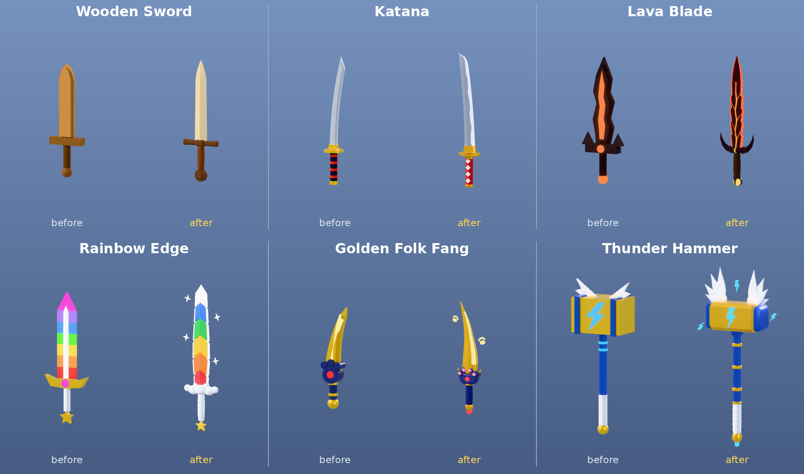

# FOLK VALLEY [RUN]: weapon models

The hunters' cosmetic weapons, remade in Blender. They keep the same structure as the old models, so they drop into the game unchanged.

**Status: style check.** These six are done: Wooden, Katana, LavaBlade, RainbowEdge, FolkFang and ThunderHammer. The other 55, plus the new Mythics, follow once the style is approved.



| Preview | What it shows |
|---|---|
| `previews/sheet_hero.png` | the six side by side, at the same scale |
| `previews/sheet_hand.png` | each one held by a 5-stud R6 avatar |
| `previews/sheet_phone.png` | all six 60 studs from a 70° Roblox camera, framed like a phone screen |
| `previews/sheet_before_after.png` | old model next to the new one, under the same lights |
| `previews/hero/`, `previews/hand/`, `previews/before/` | the single images |

## Put them in Studio

New meshes have to be uploaded to Roblox by your account, and Studio does that while it imports them. A `.rbxm` file can't carry new mesh files, so getting them in takes one import and one script:

1. **File → Import 3D →** `out/FolkValley_Weapons.fbx` **→ Import.** The default settings are fine. Leave "Merge Meshes" off.
2. **View → Command Bar:** paste all of `out/BuildWeapons.lua` and press Enter.
   - It builds `ServerStorage.Weapons` with one Model per weapon. If a `Weapons` folder is already there, the new one is called `Weapons (new)`.
   - It then deletes the imported model. Ctrl+Z undoes everything.
3. Right-click the folder **→ Save to File…** to get the `.rbxm`, or drag it to wherever the game keeps its weapons. BanHammer is not included, so copy it over from the old folder.

The script reads four small marker cubes in the FBX to work out the importer's scale and orientation. Whatever import settings you use, every part ends up at the right size and position.

## How each weapon is built (unchanged contract)

- One Model per weapon, named by its Id.
- `PrimaryPart` is a Part named **Handle**:
  - 0.4 × 0.4 × 0.4 studs, Transparency 1.
  - Placed where the hand grips.
  - The weapon points along its +Y, with the edge or hammer face toward +X and the thin side along Z.
- Every visible part is a MeshPart:
  - One mesh per colour, with a plain white material. Colour and Material are set on the part.
  - Named for what it is: Blade, Guard, Grip, Fittings, Head…
  - Welded to the Handle with a WeldConstraint.
  - Anchored, CanCollide, CanTouch and CanQuery are false. Massless is true.
- Number attributes **Top** and **Bottom**: how far the model reaches above and below the Handle along Y.
- An Attachment named **Fx** under the Handle on Epic, Legendary, Limited and Mythic weapons, at the blade tip or hammer head.
- At most 8 parts including the Handle. About 3,000 triangles or fewer. Materials are only SmoothPlastic, Metal, Neon, Glass, Wood and Fabric, with no textures.

| Id | Rarity | Parts | Triangles | Top | Bottom | Length |
|---|---|---|---|---|---|---|
| Wooden | Common | 3 | 1,464 | 4.16 | -1.05 | 5.21 |
| Katana | Uncommon | 5 | 2,386 | 4.74 | -1.00 | 5.74 |
| LavaBlade | Epic | 4 | 1,838 | 4.66 | -0.95 | 5.61 |
| RainbowEdge | Legendary | 7 | 2,883 | 5.18 | -1.10 | 6.28 |
| FolkFang | Legendary | 6 | 3,012 | 3.88 | -0.98 | 4.86 |
| ThunderHammer | Legendary | 5 | 3,020 | 6.42 | -1.22 | 7.64 |

## Rebuild

Everything is generated from code:

- `blender/defs.py` holds one function per weapon.
- `blender/wlib.py` is the modelling toolkit:
  - ridged and banded blades, katana blades
  - spiral leather wraps, wheel pommels, chamfered crossguards
  - lathes, sweeps and slabs
- `blender/build.py` builds the weapons, renders tiles and exports the FBX.
- `tools/gen_rig.py` writes `BuildWeapons.lua` from `weapons.json`.
- `blender/present.py` renders the review sheets.
- `blender/render_original.py` renders the old `.rbxm` models, rebuilding their Unions from the source parts stored inside them. It uses `tools/rbxtool`, a small Rust converter between `.rbxm` and JSON.

```sh
python3 -m venv .venv && .venv/bin/pip install bpy==5.2.2 pillow lupa
.venv/bin/python blender/build.py /tmp/w --fbx=$PWD/out/FolkValley_Weapons.fbx --hero
python3 tools/gen_rig.py /tmp/w/weapons.json out/BuildWeapons.lua
.venv/bin/python blender/present.py /tmp/p
```
